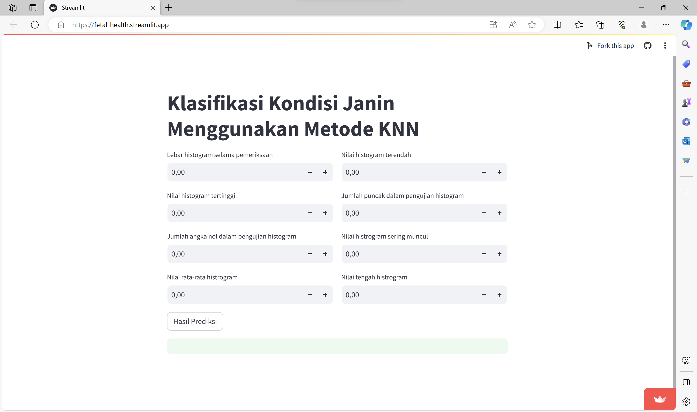

# Laporan Proyek Machine Learning
### Nama : Lia Fitriyanti
### Nim : 211351072
### Kelas : IF Pagi B

## Domain Proyek

Kehamilan merupakan suatu hal alamiah yang merupakan proses fisiologis, akan tetapi jika tidak dilakukan asuhan yang tepat atau deteksi dini komplikasi yang akurat maka akan berujung pada komplikasi kehamilan yang apabila tidak bisa diatasi akan berujung pada kematian ibu. Selain itu suatu kehamilan juga akan berhubungan dengan kesehatan janin.

Kesehatan Janin sangatlah penting diketahui calon ibu sejak dini, hingga saat ini rasa ketidak tahuan seseorang ibu tentang kesehatan janin sangatlah kurang dan bisa mengakibatkan kematian janin. Hal ini disebabkan karena kurangnya rasa ingin tahu yang dimiliki oleh calon ibu serta kurangnya sosialisasi serta sarana prasarana dari pihak – pihak terkait tentang kesehatan janin. Pada dasarnya tumbuh kembangnya sebuah calon janin sangatlah penting agar bisa terlahir dengan sehat dan tidak ada hambatan sama sekali.

Suatu proses kehamilan bahkan persalinan merupakan masa kritis bagi ibu hamil. Karena setiap kemungkinan bisa terjadi pada saat persalinan baik dari ibu ataupun bayi maka dari itu harus diberikan nya edukasi kepada para calon ibu betapa penting nya menjaga kesehatan janin.
  
Format Referensi: Tentang Kehamilan dan Kesehatan Janin
- http://repo.poltekkes-maluku.ac.id/id/eprint/218/1/BUKU%20Asuhan%20Kehamilan%20full%20%281%29%20-%20Kasmiati%20lpt.pdf
- https://ejurnal.seminar-id.com/index.php/bits/article/download/2672/1645/

## Business Understanding

Dibuatnya sistem prediksi kesehatan janin ini untuk mempermudah para tenaga medis dalam melakukan tugas nya mengetahui jenis atau tipe kesehetan janin pada ibu hamil. Dalam kesehatan janin dibagi menjadi 3 yaitu :
- Normal
- Suspect
- Pathological
### Problem Statements

- Klasifikasi kesehatan janin pada pada instansi kesehatan masih dilakukan secara manual
- Memberikan informasi tentang penting nya menjaga kesehatan janin pada ibu hamil 

### Goals

- Dengan adanya sistem ini mungkin akan mempermudah para tenaga medis dalam memprediksi kesehatan janin
- Dengan memberikan informasi atau edukasi tentang penting nya menjaga kesehatan janin pada ibu hamil akan mengurangi resiko buruk yang tidak diinginkan 

    ### Solution statements
    - Membuat platform khusus untuk klasifikasi kesehatan janin pada ibu hamil melalui aplikasi dengan cara menginputkan hal-hal yang menyangkut dengan tipe kesehatan janin pada ibu hamil
    - Model yang dihasilkan dari dataset tersebut itu menggunakan metode K-Nearest Neighbors (KNN)

## Data Understanding
Dataset yang saya gunakan berasal dari Kaggle tentang kesehtan janin. Dataset ini berisi 2127 baris dan 22 kolom dengan type data float<br> 

Fetal Health https://www.kaggle.com/datasets/andrewmvd/fetal-health-classification

### Variabel-variabel pada Fetal Health Dataset adalah sebagai berikut:
- histrogram_width = lebar histogram selama pemeriksaan (float64)
- histogram_min = nilai histogram rendah (float64)
- histogram_max = nilai histogram tinggi (float64)
- histogram_number_of_peaks = jumlah puncak dalam pengujian histogram (float64)
- histogram_number_of_zeroes = jumlah angka nol dalam pengujian histogram (float64)
- hist_mode = nilai histrogram sering muncul (float64)
- hist_mean = nilai rata rata histogram (float64)
- hist_median = nilai tengah histogram (float64)
- fetal_health = tipe kondisi kesehatan janin dengan 3 tipe normal, suspect, pathogical (float64)

Deskripsi kolom fetal_health :
- Normal : kondisi ini merujuk pada kondisi kesehatan dan perkembangan janin sesuai dengan ekspektasi untuk usia kehamilan tertentu, selain itu tidak terlihat tanda-tanda adanya masalah dalam kesehatan janin.
- Suspect : dalam kondisi ini ada tanda-tanda atau gejala yang tidak sepenuhnya normal, memerlukan pemantauan dan evaluasi lebih lanjut.
- Pathological : dalam kondisi ini adanya bukti masalah atau kelainan kesehatan yang memerlukan perhatian medis segera.

## Data Preparation
Pertama, pastinya menginputkan library yang di gunakan terlebih dahulu.
```python
import pandas as pd
import numpy as np
import matplotlib.pyplot as plt
import seaborn as sns

from sklearn.model_selection import train_test_split
from sklearn.neighbors import KNeighborsClassifier
from sklearn import metrics
from sklearn.metrics import classification_report

import plotly.graph_objs as go
import plotly.offline as py
import plotly.express as px

import pickle

import warnings
warnings.filterwarnings('ignore')
```
Kedua, import file dataset yang digunakan. Berhubung menggunakan google colab ada sedikit perbedaan dengan yang menggunakan vscode karena ada tambahan API Command.
```python
df = pd.read_csv('fetal-health-classification/fetal_health.csv')
```
Ketiga, menampilkan info dari atribut yang digunakan.
```python
df.info()
```
Keempat, menginisialisasi sebuah variabel yang di dalam nya berisi atribut yang ingin gunakan.
```python
kol = ["histogram_width", "histogram_min", "histogram_max", "histogram_number_of_peaks",
    "histogram_number_of_zeroes", "histogram_mode", "histogram_mean", "histogram_median", "fetal_health"]
```
Kelima, berhubung atribut yang digunakan semua type data nya float maka harus ubah ke integer.
```python
df[kol] = df[kol].astype(int)
df.info()
```
- Alasan saya melakukan data preparation ini sebab hampir semua atribut memiliki tipe data float64 dan saya harus mengubahnya kedalam type data int64.

## Modeling
Model ini menggunakan algoritma K-Nearest Neighbors (KNN). Pertama, import library digunakan. Lalu seleksi fitur mana yang akan di jadikan label.
```python
X = df.drop('fetal_health', axis=1)
y = df['fetal_health']
```
Selanjutnya, menentukan data yang akan dijadikan menjadi data training dan data testing. Sebanyak 30% dari data asli akan diambil untuk dijadikan bagian test. Sedangkan, 70% dari data asli akan dijadikan bagian train.
```python
X_train,X_test,y_train,y_test = train_test_split(X,y,test_size=0.3,random_state=2)
```
Selanjutnya, dengan menggunakan K-Nearest Neighbors (KNN) untuk mengevaluasi performa model terhadap berbagai jumlah titik (k) di dataset.
```python
test_scores = []
train_scores = []

for i in range(1,15):

    knn = KNeighborsClassifier(i)
    knn.fit(X_train,y_train)

    train_scores.append(knn.score(X_train,y_train))
    test_scores.append(knn.score(X_test,y_test))
```
Lalu, mencari nilai tertinggi skor training, testing dan menemukan nilai k yang terkait dengan skor tersebut.
```python
max_train_score = max(train_scores)
train_scores_ind = [i for i, v in enumerate(train_scores) if v == max_train_score]
print('Max train score {} % and k = {}'.format(max_train_score*100,list(map(lambda x: x+1, train_scores_ind))))
```
```python
max_test_score = max(test_scores)
test_scores_ind = [i for i, v in enumerate(test_scores) if v == max_test_score]
print('Max test score {} % and k = {}'.format(max_test_score*100,list(map(lambda x: x+1, test_scores_ind))))
```
Kemudian, menguji model KNN dengan 3 k nearest neighbor.
```python
knn = KNeighborsClassifier(3)

knn.fit(X_train,y_train)
knn.score(X_test,y_test)
```

## Evaluation
Menggunakan algoritma K-Nearest Neighbors dengan jumlah titik k (3), didapatkan hasil akurasi sebesar 0.8432. 

## Deployment
https://fetal-health.streamlit.app/



